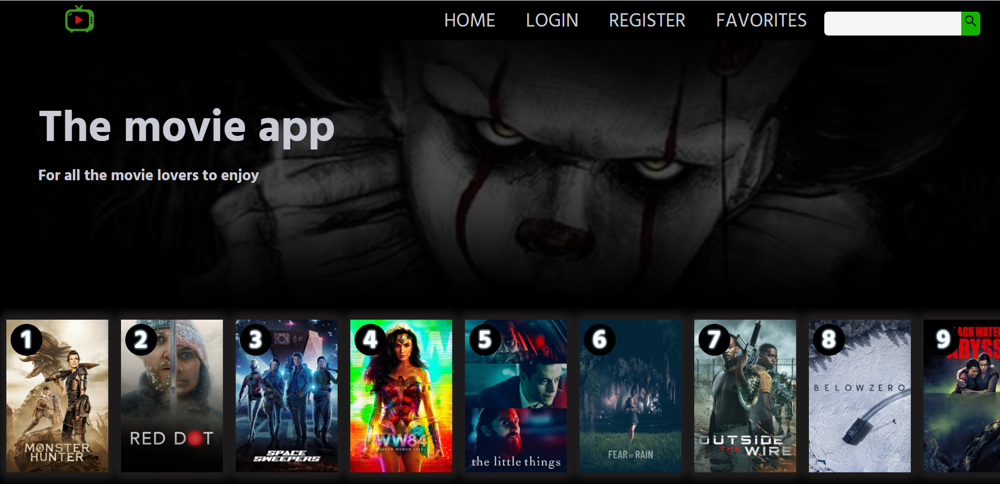

# React-movie-app

A movie application created in React and TypeScript using the [TMDB API](https://www.themoviedb.org/). The application is styled with [Styled Components](https://styled-components.com/). The data persist using local storage. At this point only the frontend of the app is almost completed. The user can search, add and remove movies from his own movie list.

## To do

- **Fetch the movie data from the backend using axios**
- **Connect with MongoDB Atlas data base to store user data**
- **User authentication**
- **Error handling on the backend and the frontend**
- **Deploy the app**

## Would you like to try it out

- **Clone the repo: https://github.com/Danijela2019/react-movie-app.git**
- **Get a free API key from [TMDB](https://www.themoviedb.org/) and change the apyKey variable with your API key**
- **Position yourself (cd) in the 'movie-app' folder**
- **Run this command in the terminal to install packages: 'npm install'**
- **Next run this command in your terminal 'npm start'**
- **View the application in the browser(http://localhost:3000)**

#### Consider creating .env file inside the project root folder and add your API key there like so: REACT_APP_API_KEY=YOUR API KEY
